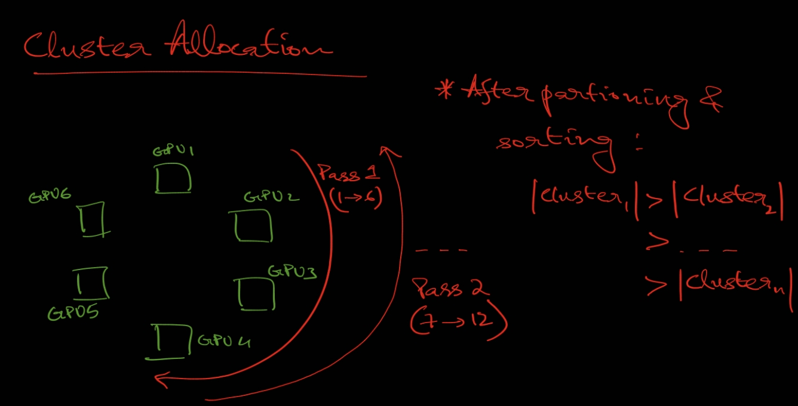
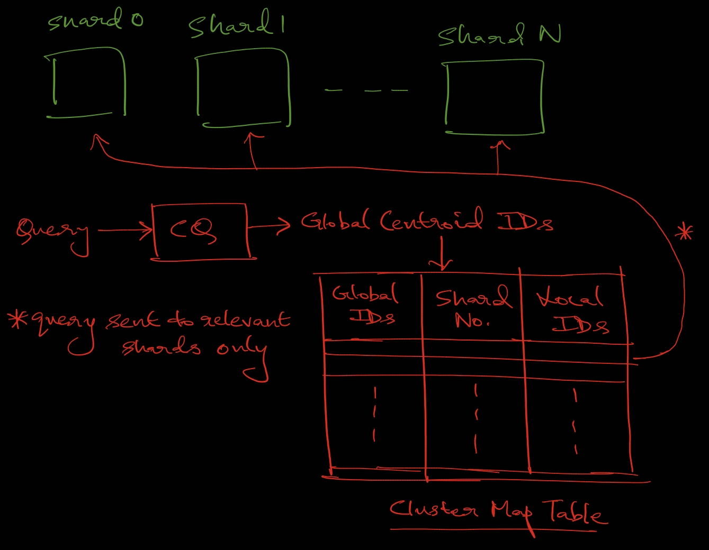
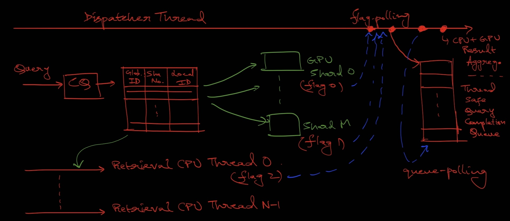

# VectorLiteRAG: Latency-Aware and Fine-Grained Resource Partitioning for Efficient RAG

**Authors:** Junkyum Kim and Divya Mahajan

**Link:** https://arxiv.org/abs/2504.08930

## Key Points
### Issues solved

- **CPU-based vector retrieval becomes the bottleneck in RAG** due to high ANN search latency on large vector databases.
- Moving retrieval fully onto GPUs causes **contention with LLM inference** for GPU memory, KV cache, and compute resources.
- IVF vector indexes exhibit **highly skewed access patterns**, where a few “hot” clusters dominate retrieval traffic.
- Query hit rates **vary significantly across batches**, causing tail-latency amplification during batched retrieval.
- Existing GPU caching systems **optimize throughput but ignore SLO** requirements.

### Solutions proposed

- VectorLiteRAG partitions IVF indexes across CPU and GPU **using latency-aware hybrid caching.**
- **Hot clusters are cached on GPUs** while cold clusters remain on CPUs to reduce contention and improve retrieval speed.
- A **performance + hit-rate model** predicts **optimal CPU/GPU partitioning** under given SLO constraints.
- Query-aware routing **sends only relevant cluster probes to each GPU shard**, reducing wasted GPU work.
- A **dynamic dispatcher forwards early-finished queries** immediately to reduce straggler delays (slowest request in a batch) and improve batching efficiency.
- **Runtime adaptive re-profiling** updates hot-cluster placement when workload distributions drift over time.
- Overall, the system **improves SLO-compliant throughput by up to 1.5×** without extra hardware.

## Challenges with RAG Serving
- GPU-accelerated IVF search - outperform fast scan methods by nearly an order of magnitude - but KV cache exists in GPU, resource/memory contention - careful memory and compute allocation required
- IVF index access patterns - highly skewed - small number of clusters account for the vast majority of retrievals - motivates tiered index design - frequently accessed clusters -  prioritized for acceleration (e.g., GPU caching) - cold clusters - offloaded to lowertier compute and storage.
- Large variance of hot-cluster hit rates within batch - batch is as fast as slowest query (tail-queries) - significant limitation to GPU caching
## VectorLiteRAG
- computes a **partitioning point** for tiered search, **constructs the hybrid index**, and serves inference requests through a **tailored pipeline**.

### Hybrid Index Construction

**Profiling-Based Performance Modelling**
- Cailibration queries: run through system
- Obtain:
    - Latency distribution of CPU-based vector search (sequential execution is measured, then parallelized)
    - Cluster access frequency distribution
    - Throughput of bare LLM on GPU
- `Vector-search latency measurement`
    - dominated by two components;
        1. CQ (course quantization) - CPU resident - HNSW - irregular mem access, memory-bound, too many device transitions
        2. LUT ops - distance computation - SIMD/parallel friendly - **offload to GPU**
    - CPU search latency : piecewise linear : batch size (observed jump from single-threaded (trivial) to multi-threaded)
    - LUT ops on GPU : fully hidden by cache-miss distance-ops (LUT on CPU) ($|\tau_{LUT}^{CPU}| >> |\tau_{LUT}^{GPU}|$) (masked)
    - Latency measure: 
    $\tau_s(b) = \tau_{CQ}^{CPU}(b) + (1-\eta)\tau_{LUT}^{CPU}(b)$
    ($\eta$- minimum hit rate (worst-case))

    

**Tail Query Hit Rate Estimation**
- CPU side LUT workload : proportional to miss rate (1 − $\eta$) : variance translates into differences in search latency
- Minimum hit-rate: beta distribution $f(x)$ :
$\boxed{\eta_{min}(B) = \int_{0}^{1}B.x.f(x).(1-F(x))^{B-1}.dx}$

    where $F(x) = \int_{0}^{x}f(y).dy$ (CDF of $f(x)$)
    $B$ - batch size - also beta distribution param
    **Intuition** - lower $B$ (say $B=2$) - tail-queries less likely
        - higher $B$ (say $B=128$) - tail-queries more likely
- Variance : observed : high for $\eta = 0.5$ and low for $\eta \rightarrow 0$ or $\eta \rightarrow 1$ : hence, emperically:
$\boxed{\sigma^2 \approx 4.\sigma_{max}^2.\eta.(1-\eta)}$ 
- $\rho$ : cache coverage on GPU
- Experimentally (**important**): 
    - sweep $\rho$ and $B$
    - find $\eta_{min}$ for each
    - inverse-lookup: **for given $B$ and SLO (defines $\eta_{min}$) : what is min possible $\rho$**
    $\boxed{\rho = HitRate2Coverage(B,\eta_{min})}$
    - this function is implemented by the latnecy-bound partitioning algorithm

**Latency-Bounded Partitioning Algorithm**
- Inputs:
    - $SLO_{Search}$ - latency target
    - $MEM_{KV cache}$ - baseline KV cache memory footprint when no vector index is loaded
    - $\mu_{LLM0}$ - peak LLM-only throughput on GPU
- Output:
    - $\rho$ - partitioning points (fraction of DB resident in GPU-cache)
- Goal:
    - Maximize $\rho$ subject to $MEM_{KV cache} + \rho \times MEM_{DB} \le MEM_{GPU}$
- Params:
    - $\epsilon$ - queuing delay factor (requires $\tau_s$ to be lesser than SLO due to queuing)
- (Revisit algorithm explanation)
    
        
    

**Index Splitter**
- After $\rho$ is determined
- Identifies hot clusters (from access profiles - cumulative frequency) and $\rho$
- Hot clusters - sorted by size - sent to GPU shards using straightforward **round-robin** (as per the paper).
- *Optimization Idea:* Use a **zig-zag (snake-like) round-robin** scheme instead to better balance sub-index memory usage:
  - 1st pass: allot clusters descending by size from GPU 0 to $N-1$
  - 2nd pass: alternate direction and allot from GPU $N-1$ to 0, and repeat. This ensures both the sum and mean of cluster sizes per GPU remain similar.

- Generates map tables - mapping global cluster IDs $\rightarrow$ shard ID, local cluster ID (simple LUT, CPU-hosted)

### Distributed VectorLiteRAG Pipeline

**Router**

- Default router (according to paper) - FAISS - IndexIVFShards
- IndexIVFShards - uniformly distributes equal no. of clusters to GPU shards - query broadcasted to all shards - waste of compute in shards without required clusters - memory overhead, scheduling bandwidth loss
- Instead - splitter generates mapping tables - CQ occurs in CPU - query sent to appropriate shards only - different `nprobe` per shard
- Shards idle with no retrieval distance computation - more LLM throughput
- After CQ - query sent to required shards - LUT distance computation : CPU (slow clusters) + some GPU shards (hot clusters, mapping table)

**Dynamic Dispatcher**
\*\*`Note`: minimum hit rate - hit rate of tail-query (stragglers)
- Goal - accelerates early query completion
- CPU - vector distance computing threads + `dispatcher thread`
- Each shard - has a completion flag - unique to query
- `dispatcher thread`:
    - poll for completion flags from all shards (GPU + CPU threads)
    - If a flag is set - adds no. of clusters chcekd by shard to `global cluster counter`- compared with nprobe
    - If count exceeds nprobe - add to query to thread-safe queue
    - poll for queries in completion queue, forward ejeted queries to database (vector-passage conversion)

**Adaptive Runtime Index Update**

## Limitations

## Summary